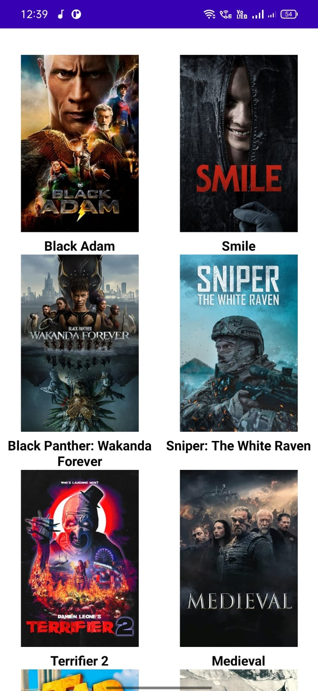
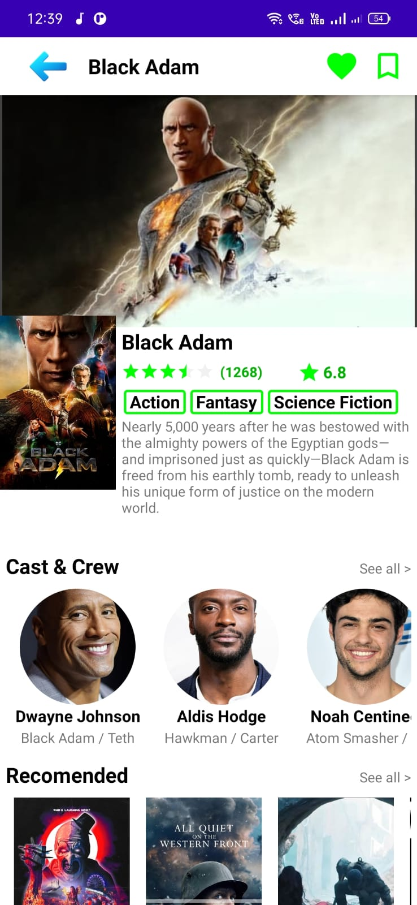
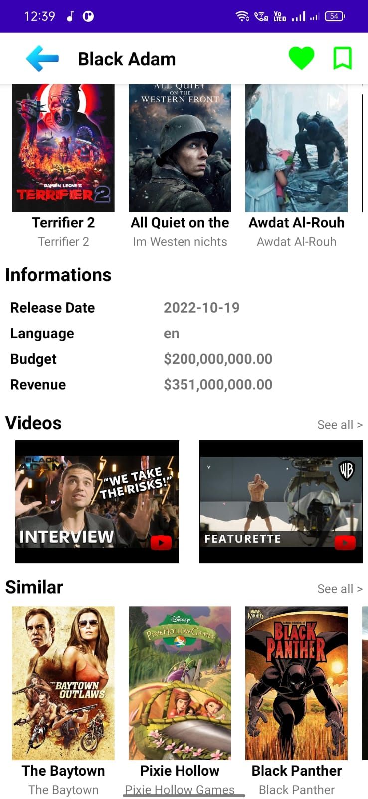
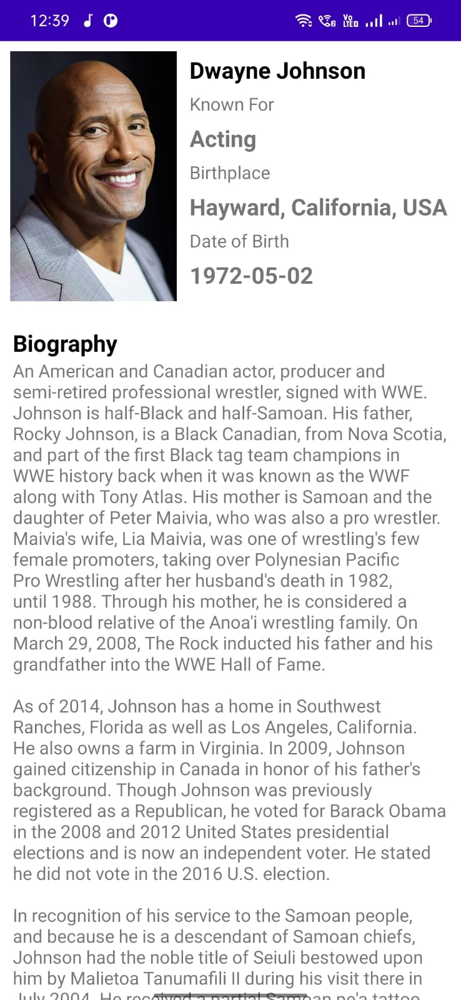
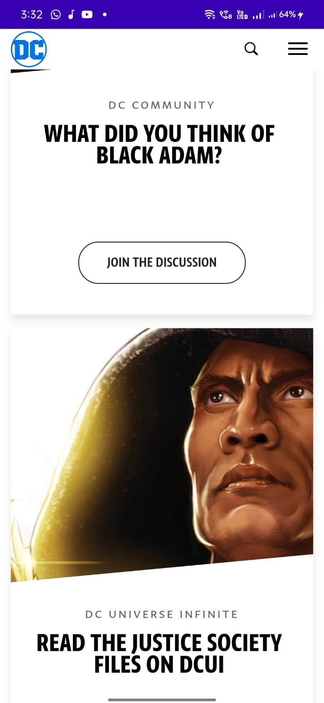

<h1>Movie App</h1>

<body>

</body>
</html>

 
 
 

<h2>Features</h2>

<h3># MVVM Clean Architecture</h3>
<h3># TMDB Client</h3>
<h3># View Popular Movies</h3>
<h3># View Cast</h3>
<h3># View Recomended Movies</h3>
<h3># View Similar Movies</h3>
<h3># View Movie Trailers</h3>

 
 
 

<h3>For more info: please contact "_krishnan_venugopal_" in Instagram</h3>
